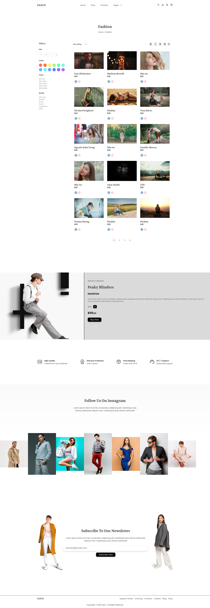

# FASCO

# 🌟 My First Front-End Practice Project

### 📖 Overview

This is my first practice project on my journey to learning front-end development. The goal was to practice fundamental concepts of HTML, CSS, and JavaScript while experiencing real-world challenges that come with building a project.

### ✨ Features

- Re-created a UI design from a free template
- Used the **Pexels API** to fetch images
- Implemented **Promise** for image loading
- Encountered and explored **CORS (Cross-Origin Resource Sharing)**

### 🚀 Technologies Used

- **HTML5**
- **CSS3** (Flexbox, Grid)
- **JavaScript (ES6)**

### 🎥 Demo

Check out the live demo of the project:  
[👉 Live Demo](https://your-demo-link.com)

### 📸 Screenshots

Here are a few screenshots of the project:

| Screenshot 1                                                                   | Screenshot 2                                                                   | Screenshot 3                                                                                      | Screenshot 4                                                                                      |
| ------------------------------------------------------------------------------ | ------------------------------------------------------------------------------ | ------------------------------------------------------------------------------------------------- | ------------------------------------------------------------------------------------------------- |
|  |  |  |  |

### 🛠️ How to Run the Project

1. Clone the repository: `git clone https://github.com/rezamerlin/FASCO.git`
2. Open folder: `cd FASCO`
3. Open file with vsCode
4. replace `API_KEY` authentication: `./APIs.js` & `./shopPage/script.js`
5. enjoy :)!
